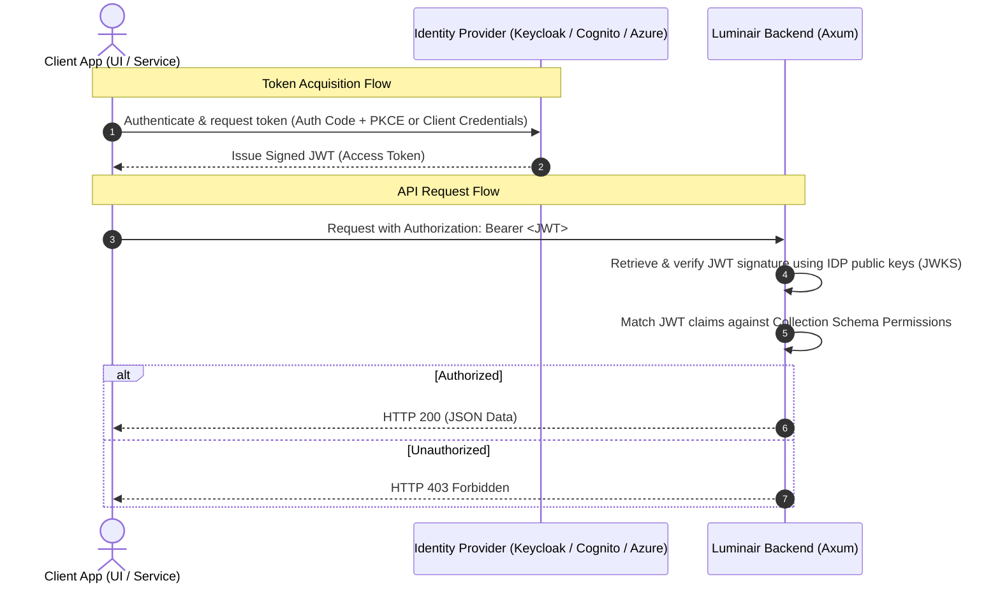
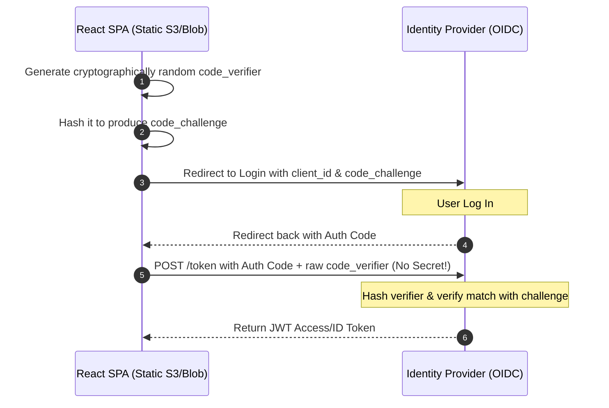

# Authentication & Authorization Architecture Design

This document details the architecture design for implementing **SSO-friendly JWT Authentication** and **Schema-Driven Role-Based Access Control (RBAC)** in Luminair CMS. 

It is designed to be identity-provider-agnostic (IDP-agnostic), supporting **Keycloak**, **AWS Cognito**, and **Azure AD (Microsoft Entra ID)**, while facilitating both **User-to-Service** (UI) and **Service-to-Service** (daemon) integration patterns.

---

## 🏛 1. Overall Authentication Architecture

To keep the backend lightweight and secure, we delegate actual user management, credential hashing, and single sign-on (SSO) to an external OIDC Identity Provider (IDP). The backend acts as a **Resource Server** that verifies signatures of incoming JSON Web Tokens (JWTs).



---

## 🔑 2. JWT Verification (Backend Resource Server)

The backend service does not store passwords or maintain session tables. It validates incoming JWTs using the **JSON Web Key Set (JWKS)** provided by the IDP.

### OIDC Discovery Configuration
The backend requires a single configuration property: the **OIDC Issuer URI**.
```yaml
# config/default.yaml
auth:
  issuer_uri: "https://<idp-domain>/realms/<realm-name>" # E.g., Keycloak Realm URL
  audience: "luminair-api"
```

During startup, the backend:
1. Fetches the metadata from `${issuer_uri}/.well-known/openid-configuration`.
2. Locates the `jwks_uri` parameter.
3. Downloads the cryptographic public keys from `jwks_uri`.
4. Caches these keys in memory to perform fast, sub-millisecond local signature checks.

### Recommended Rust Libraries
* `jsonwebtoken`: For decoding header tokens and matching signatures.
* `reqwest`: To query the JWKS endpoint.
* `axum-extra / jsonwebtoken`: For implementing the validation middleware.

---

## 👥 3. Integration Patterns

### User-to-Service (Luminair UI / Custom Apps)
* **Grant Type**: OAuth2 Authorization Code Flow with PKCE (Proof Key for Code Exchange).
* **Process**:
  1. The user clicks "Log In" in the React UI, redirecting them to Keycloak/Cognito.
  2. Upon successful login, the IDP redirects the user back to the UI with an authorization code.
  3. The UI exchanges this code for an Access Token and Refresh Token.
  4. The UI stores the token in memory and sends it in the `Authorization: Bearer <token>` header for all API requests.

### Service-to-Service (Daemons / Integration Services)
* **Grant Type**: Client Credentials Grant.
* **Process**:
  1. The external system authenticates with the IDP using its `client_id` and `client_secret`.
  2. The IDP issues an Access Token.
  3. The external service calls the Luminair API with the token.

---

## 🛡 4. Schema-Driven Access Control (RBAC)

To align with Luminair's schema-driven nature, we propose declaring collection permissions directly inside the `.json` schema configurations.

### Schema Permission Syntax
Add a `permissions` object under the `options` section in any collection (e.g., `recipes.json`):

```json
{
  "type": "collection",
  "info": {
    "title": "Recipes",
    "singularName": "recipe",
    "pluralName": "recipes"
  },
  "options": {
    "draftAndPublish": true,
    "permissions": {
      "read": ["role:family_member", "role:nutritionist"],
      "write": ["role:nutritionist"],
      "publish": ["role:nutritionist"]
    }
  }
}
```

### Claim Parsing & Middleware Check
When the backend processes a request:
1. The token is verified.
2. The user's roles are extracted from the claims (typically `roles`, `groups`, or `cognito:groups` depending on the IDP configuration).
3. The route middleware matches the user's role against the target schema’s required permission array (e.g. `write` for `POST /api/documents/recipes`).
4. If no permissions are declared in the schema, the endpoint defaults to **Admin Only**.

Example JWT Payload Claim:
```json
{
  "sub": "user_12345",
  "iss": "https://keycloak.family.local/realms/family-balance",
  "aud": "luminair-api",
  "roles": [
    "family_member",
    "nutritionist"
  ]
}
```

---

## 🔗 5. Connecting Dynamic CMS Roles with External Accounts

When accounts are managed externally in the Identity Provider (Keycloak, Cognito, Azure), but roles and permissions are defined dynamically inside the Luminair database, we need a way to link them.

We achieve this using **Subject-to-Role Mapping** inside the Luminair database.

```mermaid
graph LR
    subgraph Identity Provider (SSO)
        IDP_U["User Profile<br>(subject_id: 'usr_abc123')"]
    end
    
    subgraph Luminair CMS
        LM_MAP["User-Role Mapping<br>(subject_id -> role_id)"]
        LM_ROLE["Dynamic Role<br>(e.g., 'Diabetic Specialist')"]
        LM_PERM["Permissions Table<br>(read:recipes, write:recipes)"]
    end
    
    IDP_U -->|identifies as| LM_MAP
    LM_MAP -->|assigned to| LM_ROLE
    LM_ROLE -->|grants| LM_PERM
```

### The Mechanism

1. **User Identifier (`sub`):** Every OpenID Connect (OIDC) compliant Identity Provider issues an access token containing a `sub` (Subject) claim. This is a unique, stable identifier for the user (e.g., a UUID or auth provider slug like `auth0|123456`).
2. **Dynamic Roles Table:** Luminair maintains a `roles` table containing roles created dynamically via the API/UI.
3. **Internal Mapping Table:** Luminair maintains a `user_roles` relationship table:
   ```sql
   CREATE TABLE luminair_user_roles (
       subject_id VARCHAR(255) NOT NULL, -- The 'sub' claim from the IDP JWT
       role_id UUID NOT NULL REFERENCES luminair_roles(id) ON DELETE CASCADE,
       PRIMARY KEY (subject_id, role_id)
   );
   ```

### Execution Flow:
1. **Login:** A user logs in through the UI via Keycloak/Cognito. The UI receives the JWT and sends it to the Luminair API.
2. **Identify User:** The backend middleware extracts the `sub` claim from the JWT (e.g. `sub: "usr_abc123"`).
3. **Resolve Roles:** The backend runs a quick query:
   ```sql
   SELECT role_id FROM luminair_user_roles WHERE subject_id = $1
   ```
4. **Evaluate Permissions:** The backend checks the permissions assigned to those roles and validates them against the target schema action.

### Managing the Mappings via the UI
In the **Luminair Admin Console**, you build a "Users & Access" page. Because users live in Keycloak or Cognito, the admin console:
* Queries the IDP using its admin API (e.g., Keycloak's `/admin/realms/{realm}/users` or Cognito's `ListUsers` API) to display a list of users.
* Allows the administrator to select a user from that list and assign them a dynamically created role. 
* Saving this association inserts a row into `luminair_user_roles` connecting the user's `sub` identifier with the role UUID.

---

## 🔒 6. SPA Authentication Strategies (Static Hosting Security)

Since a Single Page Application (SPA) runs entirely in the user's browser, it is a **Public Client** and cannot securely store a `client_secret` (or "password"). If a secret were packaged in the SPA, any user could inspect the Javascript source and steal it.

To resolve this on Azure, we outline three architectural paths, highlighting **Azure Static Web Apps** for the Family Balance demonstration.

### Strategy C: Serverless SSO Proxy via Azure Static Web Apps (Recommended for Demonstration)
When deploying the frontend on **Azure Static Web Apps (SWA)** (which aligns perfectly with the backend on Azure Container Apps):

* **How it works**:
  * Azure Static Web Apps includes a built-in, serverless authentication gateway that handles OAuth/OIDC exchanges natively.
  * You register the SWA with your IDP (Keycloak, Cognito, Azure AD). Azure handles the client secret securely within its backend routing layer.
  * Your React code simply queries a built-in endpoint (`/.auth/me`) to read the logged-in user profile, and SWA automatically attaches bearer headers to API calls routed through its integrated api-gateway.
* **Pros**: Zero-infrastructure BFF. You get maximum security without having to write or scale custom proxy code.
* **Cons**: Vendor lock-in to Azure's static hosting environment.

### Strategy A: Authorization Code Flow with PKCE (Core SPA Standard)
This is the standard authentication model for public clients that **does not require a client secret** and must be supported as a core fallback.



* **How it works**:
  * The IDP registers the React SPA as a **Public Client** (with `Client Authentication` set to **Off**).
  * **Proof Key for Code Exchange (PKCE)** is used: the SPA generates a temporary cryptographic key (`code_verifier`) and sends its hash (`code_challenge`) during redirect.
  * When exchanging the redirect code, the SPA sends the raw `code_verifier`. The IDP verifies it. This guarantees that interception of the authorization code alone is useless.
* **Pros**: Standardized, OIDC-compliant flow that works on any storage service (S3, Azure Blob, Netlify).
* **Cons**: Tokens are handled directly in the browser's javascript memory space, requiring strong CSP (Content Security Policy) to protect against XSS.

### Strategy B: BFF (Backend-For-Frontend) Pattern
If your security requirements mandate that JWT tokens **must never** touch the browser's Javascript storage, you run a custom backend proxy (BFF) that handles the confidential client secrets and maps the session to secure, HttpOnly, SameSite, Secure cookies.

---

## 🔒 7. Post-MVP Security Phase: DPoP (Proof of Possession)

For public clients utilizing **Strategy A (Auth Code + PKCE)**, a primary concern is token theft via Cross-Site Scripting (XSS). If an attacker steals a bearer token, they can replay it from any machine.

To prevent this in the post-MVP phase, we will implement **OAuth 2.0 Demonstrating Proof-of-Possession (DPoP)**:
* **How it works**:
  * The React SPA generates a transient cryptographic asymmetric key pair (e.g., using WebCrypto API).
  * For every API call, the client signs the request parameters (HTTP method, URI, timestamp) using its private key, generating a unique `DPoP` HTTP header.
  * The IDP binds the access token to the client's public key.
  * The Luminair backend verifies that the signature in the `DPoP` header matches the public key bound to the access token.
* **Effect**: If an attacker steals the access token, it is completely useless to them because they do not have the client's private key to sign request headers.

---

## 📋 8. Actionable Implementation Plan

To deploy this in your Container Apps system, follow these steps:

### Phase 1: Identity Provider Setup
* Deploy an instance of **Keycloak** (or configure **AWS Cognito** / **Azure Entra ID**).
* Create a **Realm** (e.g. `family-balance`).
* Configure two Clients:
  1. `family-balance-ui` (Public Client, Authorization Code Flow with PKCE, Web Origins pointing to your React frontend).
  2. `family-balance-service` (Confidential Client, Client Credentials Flow, for other services).
* Define the Roles: `family_member`, `nutritionist`, `admin`.

### Phase 2: Backend Integration
* Add OIDC configuration properties to the Axum application state.
* Build an Axum extractor middleware that intercept requests, decodes the `Authorization` header, retrieves the JWKS public key, and validates token expiration.
* Map incoming claims to the loaded schema permissions before forwarding the request to the handler.

### Phase 3: Frontend Integration
* Install a standard library like `oidc-client-ts` or `react-oidc-context`.
* Configure the OIDC client in `App.tsx` with the IDP authority URL and Client ID.
* Use React interceptors to automatically append the access token to all outgoing queries.
